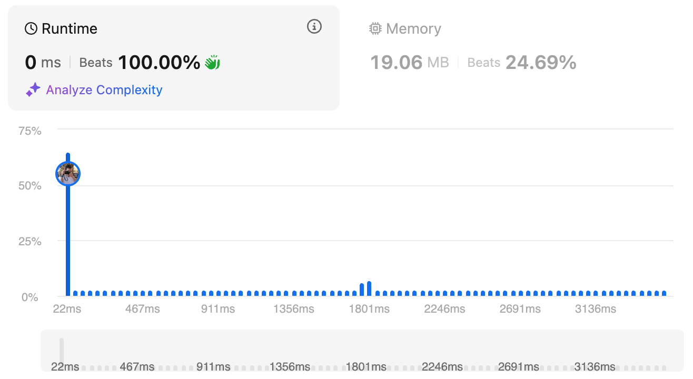

# 1. Two Sum

## Meta Information
- **Difficulty:** *Easy*
- **Tags:** *Array, Hash Table*

## Problem Description
Given an array of integers `nums` and an integer `target`, _return indices of the two numbers such that they add up to `target`._

You may assume that each input would have **exactly one solution**, and you may not use the _same_ element twice.

You can return the answer in any order.
```
Example 1:
Input: nums = [2,7,11,15], target = 9
Output: [0,1]
Explanation: Because nums[0] + nums[1] == 9, we return [0, 1].
```

```
Example 2:
Input: nums = [3,2,4], target = 6
Output: [1,2]
```

```
Example 3:
Input: nums = [3,3], target = 6
Output: [0,1]
```


**Constraints:**
- ```2 <= nums.length <= 10^4```
- ```-10^9 <= nums[i] <= 10^9```
- ```-10^9 <= target <= 10^9```
- **Only one valid answer exists.**


## Performance
The table below shows the performance of my solution on LeetCode:

| Metric   | Screenshot                                                                                 |
|----------|--------------------------------------------------------------------------------------------|
| Runtime  |                                    |
| Memory   |                                     |

