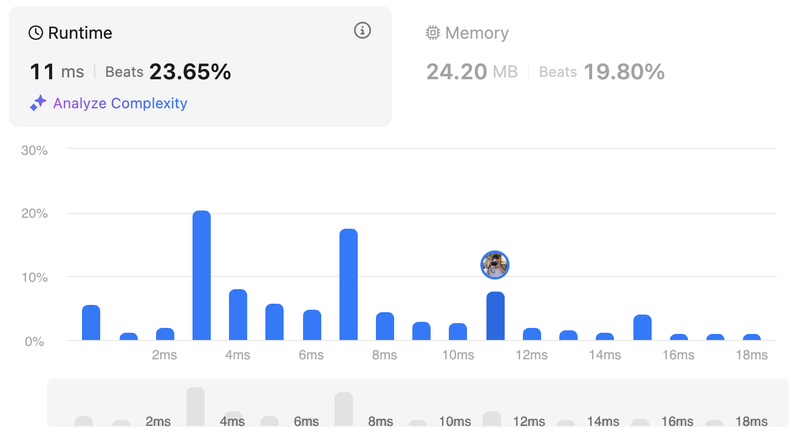

# 347. Top K Frequent Elements

## Meta Information
- **Difficulty:** *Medium*
- **Tags:** *Array, Hash Table, Divide and Conquer, Sorting, Heap (Priority Queue), Bucket Sort, Counting, Quickselect*

## Problem Description
Given an integer array nums and an integer k, return the k most frequent elements. You may return the answer in any order.
```
Example 1:
Input: nums = [1,1,1,2,2,3], k = 2
Output: [1,2]
```

```
Example 2:
Input: nums = [1], k = 1
Output: [1]
```

**Constraints:**
- ```1 <= nums.length <= 10^5```
- ```-10^4 <= nums[i] <= 104```
- `k` is in the range ```[1, the number of unique elements in the array].```
- It is **guaranteed** that the answer is **unique**.

**Follow up:** Your algorithm's time complexity must be better than `O(n log n)`, where n is the array's size.


## Performance
The table below shows the performance of my solution on LeetCode:

| Metric   | Screenshot                                                                                 |
|----------|--------------------------------------------------------------------------------------------|
| Runtime  |                                    |
| Memory   |                                     |

